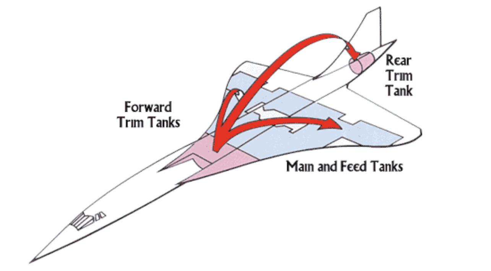
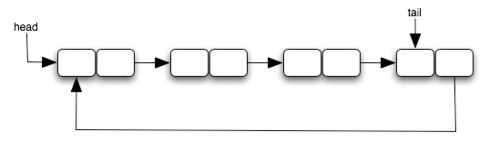
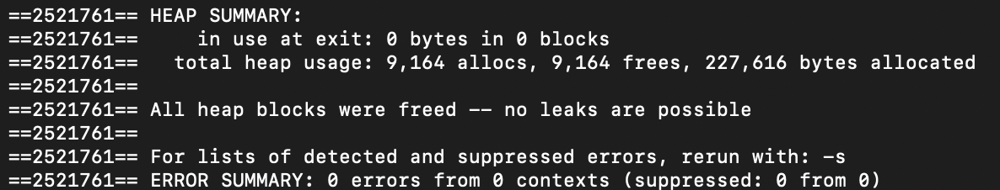

# Fuel System Simulation (Circular Linked List)

## Overview

This project implements a **fuel system simulation** for a delta-wing aircraft using a **circular linked list** in C++. The system models how fuel tanks are organized and managed within an aircraft.

The project demonstrates:

- Circular linked lists
- Dynamic memory management
- Object-oriented design in C++
- Simulation of a real-world system

---

# Real-World Inspiration: Aircraft Fuel Systems

Modern aircraft distribute fuel across multiple tanks rather than storing it in a single location. One famous example is the **Concorde**, a delta-wing supersonic aircraft.

Its fuel system served three important purposes:

- Supplying fuel to the engines
- Controlling the aircraft’s **center of gravity (CG)**
- Acting as a **heat sink** for onboard systems

During acceleration to supersonic speeds, engineers transferred fuel between tanks to shift the aircraft's center of gravity. Approximately **20 tons of fuel** could be moved between forward and rear tanks, shifting the center of gravity by about **2 meters**.

### Concorde Fuel Transfer Example



*Fuel being transferred between forward and rear trim tanks to adjust the aircraft's center of gravity.*

---

# Data Structure: Circular Linked List

The fuel system is implemented using a **circular linked list**.

In a circular linked list:

- The **last node points to the first node**
- There is **no NULL pointer**
- The list can be traversed continuously

### Circular Linked List Visualization



This structure allows the fuel system to cycle through tanks continuously when performing operations such as transfers or inspections.

---

## Project Structure

```
fuel.h        # Header file defining the FuelSys, Tank, and Pump classes
fuel.cpp      # Implementation of the fuel system data structure
mytest.cpp    # Test program containing main()
driver.cpp    # Instructor-provided driver for reference testing
README.md
images/
```

### Notes

`mytest.cpp` is the primary entry point of the program and contains the `main()` function used to run and test the fuel system implementation.

`driver.cpp` was provided by the instructor as a reference driver to help verify functionality during development. It is not required to compile or run the final program.

---

# Compilation

```bash
g++ fuel. fuel.cpp mytest.cpp -o fuel_system
```

Run:

```bash
./fuel_system
```

---

# Testing

The project includes a driver and custom test cases that verify the correctness of:

- Tank insertion
- Tank removal
- Pump management
- Circular list traversal
- Deep copy behavior

---

# Memory Safety

Dynamic memory is used for tanks and pumps. All allocated memory is properly released when tanks are removed or the system is destroyed.

### Valgrind Results



The output confirms that the program completes with **no memory leaks**.

---

# Learning Objectives

This project reinforces:

- Circular linked list implementation
- Pointer management
- Dynamic memory allocation
- Deep copying in C++
- Real-world applications of data structures
